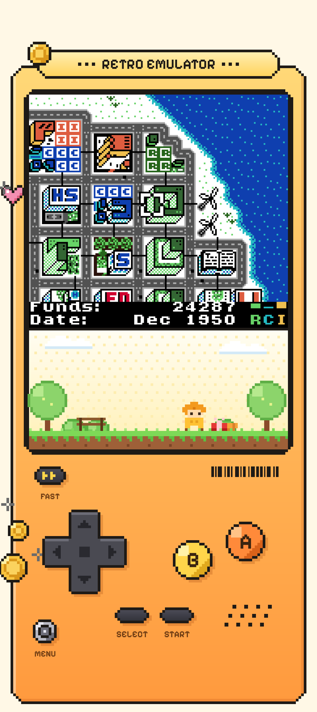
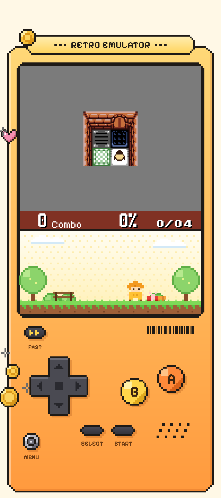
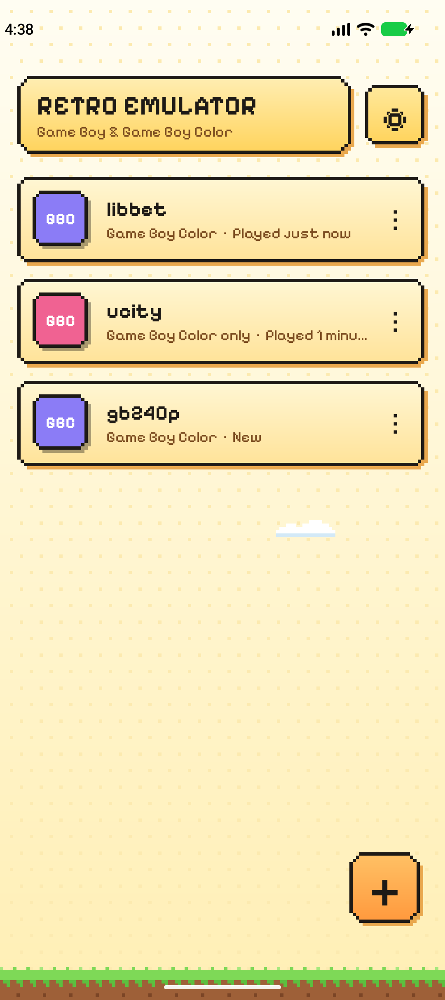
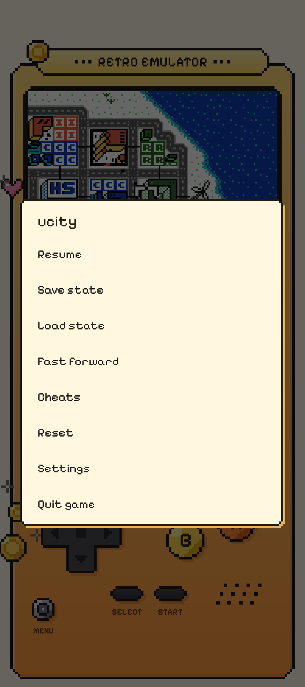
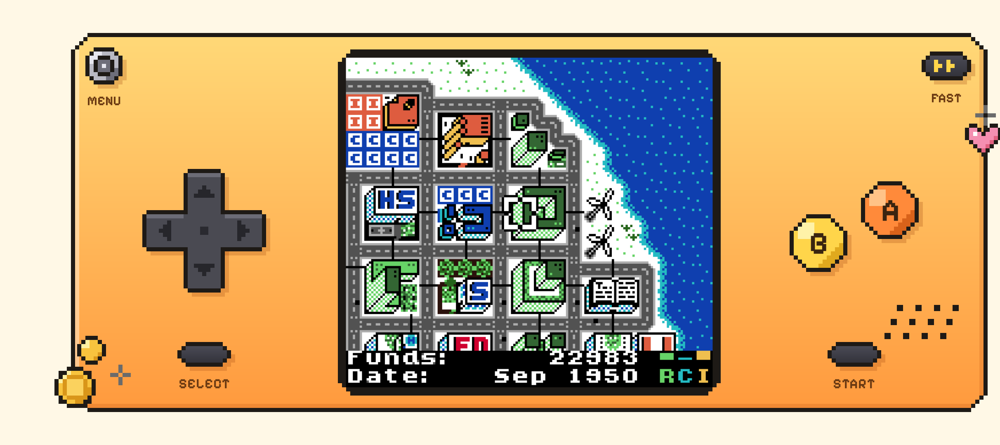
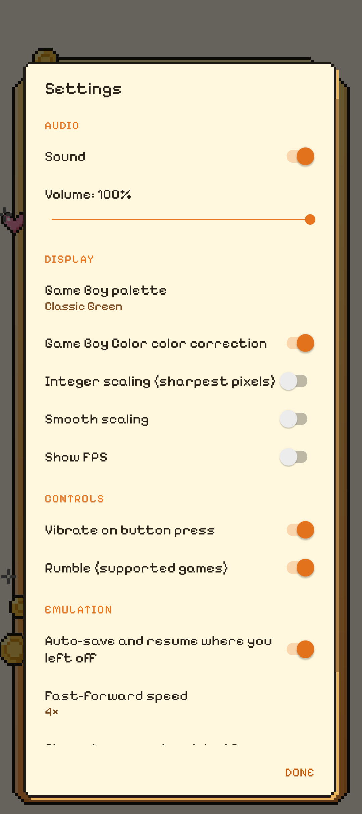

# Retro Emulator

A fast, accurate **Game Boy and Game Boy Color emulator for Android**, written from scratch in Kotlin with no third-party dependencies. Games play inside a pixel-art handheld: an orange console with a chunky ink outline, a little park scene under the screen, coins and a heart.

<p align="center">
  
  
  
  
</p>
<p align="center">
  
  
</p>

<sub>Screenshots show the open-source homebrew games <a href="https://github.com/AntonioND/ucity">µCity</a> by AntonioND and <a href="https://github.com/pinobatch/libbet">Libbet and the Magic Floor</a> by Damian Yerrick.</sub>

## Features

**Emulation**
- Game Boy (DMG) and Game Boy Color (CGB), including CGB double speed, HDMA, VRAM/WRAM banking and color palettes.
- M-cycle-accurate SM83 CPU; every memory access advances the timer, PPU, APU and DMA in lockstep.
- Scanline PPU with per-dot mode timing (SCX, window and sprite penalties) and catch-up rendering, so mid-scanline raster effects work.
- Full APU: two square channels (with sweep), wave and noise channels, frame sequencer, and the length/envelope quirks. Output is band-limited, resampled to the device's native rate, and DC-filtered like the real hardware.
- Cartridges: ROM only, MBC1 (including MBC1M multicarts), MBC2, MBC3 with real-time clock (and MBC30), MBC5 (with rumble) and HuC1.

**App**
- Pixel-art design throughout. The handheld, controls and decorations are drawn in code on a grid of whole screen pixels, so they stay crisp on any display. The library, menus and dialogs use the same palette and a pixel font.
- Game library. Import `.gb`, `.gbc` or `.zip` files from any folder, or with "Open with" from a file manager.
- Battery saves are written automatically. The MBC3 clock keeps running while the app is closed, and saves are compatible with VBA-M, BGB and mGBA, with import and export.
- Five save-state slots, plus automatic save and resume when you leave a game.
- Multi-touch controls with D-pad diagonals and an A+B press zone, laid out on the handheld's body: below the screen in portrait, either side of it in landscape. Quick taps always register.
- Physical gamepads and keyboards, including analog sticks and the D-pad hat.
- Fast-forward (2×, 3×, 4× or 8×), with tap to toggle or hold R1.
- GameShark and Game Genie cheats.
- Eight palettes for original Game Boy games, optional GBC LCD color correction, and sharp pixel scaling with optional integer or smooth scaling.
- Haptic feedback, rumble for MBC5 rumble cartridges, and an FPS counter.

## Install

1. Download `RetroEmulator-v*.apk` from the [latest release](../../releases/latest).
2. Open it on your Android device (Android 8.0 or newer) and allow installing from your browser or file manager when asked.
3. Tap **Add games** and pick your ROM files.

> **No games are included.** Use ROMs you dumped from cartridges you own, or freely distributed homebrew. Sites such as [Homebrew Hub](https://hh.gbdev.io/) list hundreds of free games.

## Controls

| Game Boy | Touch | Gamepad | Keyboard |
|---|---|---|---|
| D-pad | D-pad (slide between directions) | D-pad / left stick | Arrow keys / WASD |
| A | A | B (right face button) or Y | X / K |
| B | B | A (bottom face button) or X | Z / J |
| Start | Start | Start | Enter |
| Select | Select | Select | Space / Backspace |
| Menu | MENU knob / Back | Mode, L1 or left-stick click | Esc |
| Fast-forward | FAST button | Hold R1 / R2 | – |

The gamepad mapping is positional: the right face button is A, as on a real Game Boy.

## Accuracy

The core is checked against the standard hardware test suites from [c-sp/game-boy-test-roms](https://github.com/c-sp/game-boy-test-roms). See [Running the tests](#running-the-tests).

| Suite | Result |
|---|---|
| Blargg `cpu_instrs`, `instr_timing`, `mem_timing`, `mem_timing-2`, `halt_bug` | ✅ all pass |
| Blargg `dmg_sound` | 9 / 12. Sub-tests 09, 10 and 12 cover DMG wave-RAM access while the channel plays. |
| `dmg-acid2`, `cgb-acid2` | ✅ pixel-perfect |
| Mooneye acceptance + MBC suites (DMG) | ✅ 93 / 94 (`timer/rapid_toggle` fails) |

## Building

Requirements: JDK 17 or newer and the Android SDK (platform 36). Android Studio's bundled JDK works.

```sh
./gradlew assembleRelease        # app/build/outputs/apk/release/app-release.apk
./gradlew assembleDebug
```

Release builds are signed with the key described in a `keystore.properties` file in the project root. That file is git-ignored and holds `storeFile`, `storePassword`, `keyAlias` and `keyPassword`. Without it, release builds fall back to the debug key.

### Running the tests

```sh
mkdir -p testroms && cd testroms
curl -LO https://github.com/c-sp/game-boy-test-roms/releases/download/v7.0/game-boy-test-roms-v7.0.zip
unzip game-boy-test-roms-v7.0.zip && cd ..
./gradlew testDebugUnitTest
```

Reports and screenshots are written to `app/build/test-screens/`. The optional smoke tests in `HomebrewSmokeTest` also play three open-source homebrew games if you place them in `testroms/games/`: [libbet.gb](https://github.com/pinobatch/libbet/releases/download/v0.08/libbet.gb), [gb240p.gb](https://github.com/pinobatch/240p-test-mini/releases/download/v0.23/gb240p.gb) and [ucity.gbc](https://github.com/AntonioND/ucity/releases/download/v1.3/ucity.gbc).

## Project layout

```
app/src/main/java/com/retroemulator/gb/
├── core/      Emulator core (pure Kotlin, no Android dependencies)
│   ├── GameBoy.kt     System bus clock, frame loop, save states
│   ├── Cpu.kt         SM83 CPU
│   ├── Ppu.kt         Graphics
│   ├── Apu.kt         Sound
│   ├── Mmu.kt         Memory map, OAM DMA, HDMA
│   ├── Timer.kt, Joypad.kt, Serial.kt
│   ├── Cartridge.kt   Header parsing, MBCs, real-time clock
│   └── Cheats.kt      GameShark / Game Genie
├── emu/       Emulation thread, audio output and pacing
├── data/      ROM library, settings, palettes, cheat storage
└── ui/        Emulator screen, handheld skin and layout, controls, dialogs
    └── pixel/ Pixel-art drawing helpers (stepped boxes, discs, sprites)
```

## Not supported

- Link cable (multiplayer and trading)
- Super Game Boy borders and palettes
- Rare cartridge types: MBC6, MBC7 (tilt sensor), HuC3, MMM01, TAMA5 and the Pocket Camera. The app reports these as unsupported when you import them.

## License

MIT. See [LICENSE](LICENSE).

The bundled [Pixelify Sans](https://github.com/eifetx/Pixelify-Sans) font is licensed under the SIL Open Font License 1.1 (see [licenses/PixelifySans-OFL.txt](licenses/PixelifySans-OFL.txt)).
